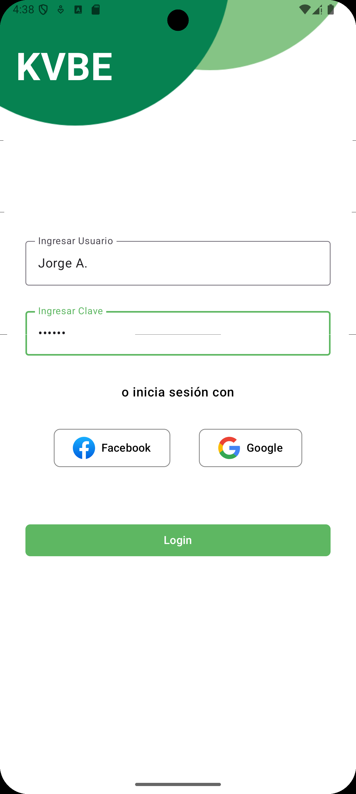
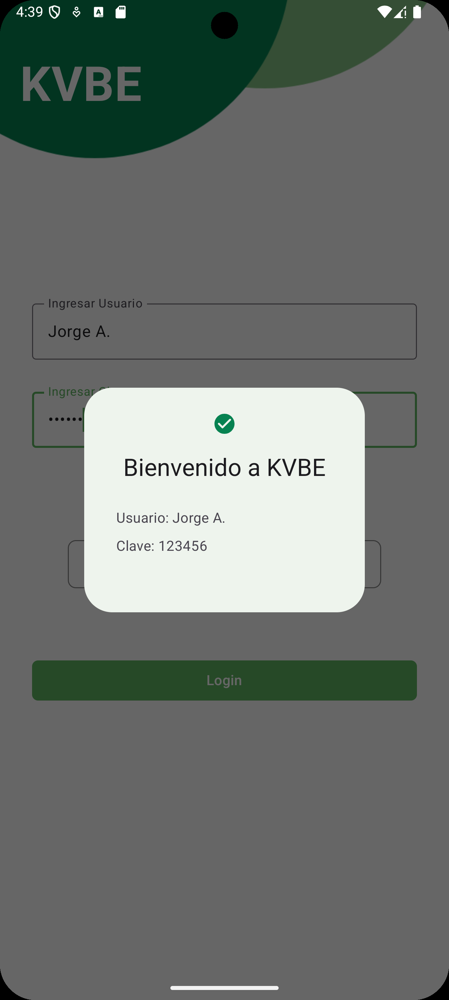
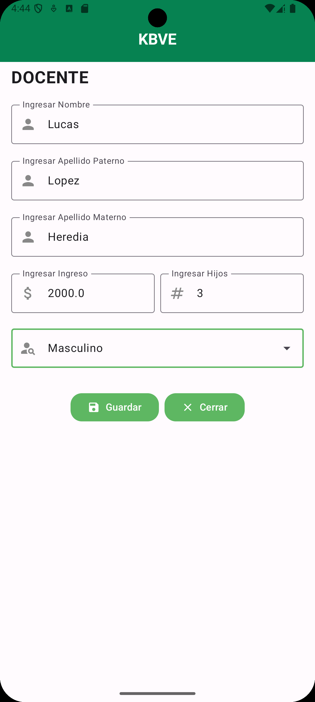
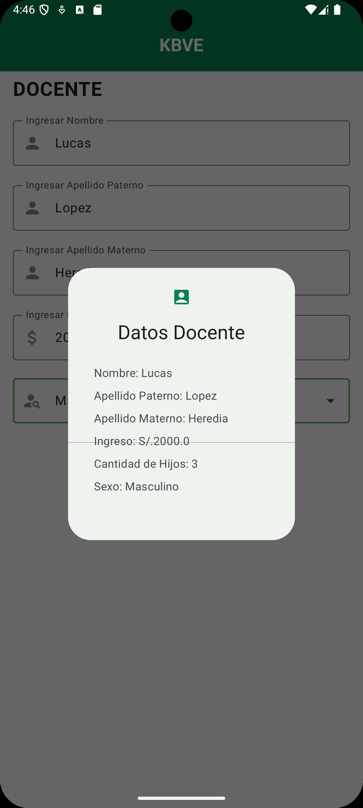

# Clase Semana 6
Desarrollo de los ejercicios de la clase de la semana 6

A tomar en cuenta:
- No se uso ViewModel, ya que el enfoque de la clase era el uso de Material Design
- Dentro del único [Activity](./app/src/main/java/com/example/clases6/MainActivity.kt), se puede escoger entre la vista del login y la vista del docente
- Se cambio el Tema default de la aplicación a uno de tonalidades Verdes [Themes](./app/src/main/java/com/example/clases6/ui/theme/Theme.kt), [Colors](./app/src/main/java/com/example/clases6/ui/theme/Color.kt)

## Resultado

## Pantalla Login

## Pantalla Docente

