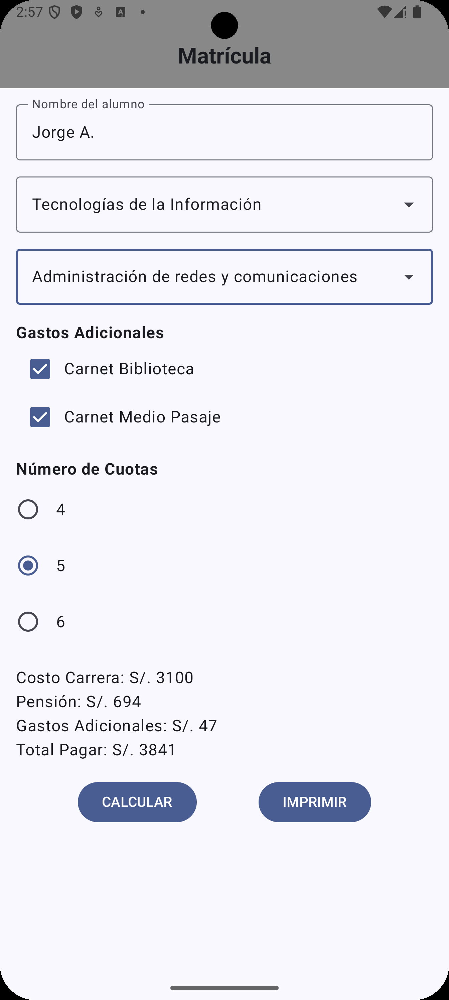
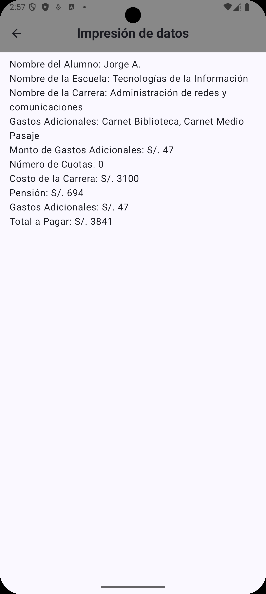

# Tarea Semana 3
Desarrollo de la tarea de la semana 3
PD: Probe creando un ViewModel para PrintActivity, funciona, pero creo que no es necesario, ya que solo es un activity que muestra un mensaje, no tiene logica de negocio. Sería mejor un DataClass como los otros proyectos.

## Resultado

## Pantalla Principal

## Pantalla de Detalle

